# 🍽️ Mess Solution

> **Solution is here!** — A Java desktop application for managing shared household mess expenses, meal tracking, and automated cost calculation.

---

## 🧾 About

**Mess Solution** is a desktop application built in Java that simplifies the monthly expense management of a shared bachelor household (mess). It tracks each member's bazar (grocery) contributions, meal consumption, utility bills, and automatically calculates how much each person owes at the end of the month.

> A solo project by **Md. Sahadat Islam** from American International University-Bangladesh (AIUB).

---

## ✨ Features

- **User Authentication** — Sign up, sign in with email/password, and password reset
- **Terms & Conditions** — Users must agree before accessing the app
- **Create & Manage a Mess** — Set up a mess with name, month, members, and utility bills
- **Add Participants** — Add member details including bazar costs across terms and meal count
- **Show Participants** — View all members' individual contribution data at a glance
- **Edit Utility Bills** — Manage house rent, gas, water, electricity, helping hand, dust, internet, and others
- **Final Calculation** — Auto-calculate each member's net cost and amount to pay
- **Download Details** — Export the full mess summary as a `.txt` file to your device
- **Edit Profile** — Update personal info, email, and password
- **Formulas Viewer** — Transparent view of the calculation logic used

---

## 🛠️ Tech Stack

| Component | Technology |
|-----------|-----------|
| Language | Java |
| GUI Framework | Java Swing |
| Data Storage | File-based (`.txt` files) |
| IDE | VS Code / IntelliJ IDEA |
| Build | Manual `javac` / Java Projects |

---

## 🚀 Getting Started

### Prerequisites

- Java Development Kit (JDK) 8 or higher
- VS Code with Java Extension Pack **or** IntelliJ IDEA

### Running the Application

1. **Clone the repository**
   ```bash
   git clone https://github.com/SahadatIslamAsif/MessSolution.git
   cd MessSolution
   ```

2. **Navigate to the source folder**
   ```bash
   cd MessSolution-main
   ```

3. **Compile and run**
   ```bash
   javac Run.java
   java Run
   ```

   Or using the VS Code terminal shortcut used in the project:
   ```bash
   cd "MessSolution\MessSolution-main" ; if ($?) { javac Run.java } ; if ($?) { java Run }
   ```

4. The app will launch with the **Sign In** window. Register a new account to get started.

---

## 📁 Project Structure

```
MessSolution/
├── MessSolution-main/
│   ├── Data/                         # File-based data storage
│   │   ├── IndividualCalculatedData.txt
│   │   ├── LogInTempFile.txt
│   │   ├── NewMessInfo.txt
│   │   ├── Totals.txt
│   │   ├── UserDetails.txt
│   │   └── UtilityBills.txt
│   ├── Images/                       # App image assets
│   ├── MyClasses/                    # All Java source classes
│   │   ├── AddParticipant.java
│   │   ├── CreateMess.java
│   │   ├── HomePage.java
│   │   ├── MemberDetails.java
│   │   ├── MyProfile.java
│   │   ├── ShowFinalCalculation.java
│   │   ├── SignIn.java
│   │   ├── SignUp.java
│   │   ├── TermsAndConditions.java
│   │   └── UtilityBills.java
│   ├── MyInterfaces/                 # Java interfaces
│   ├── Run.java                      # Entry point
│   └── License.txt
└── README.md
```

---

## 👨‍💻 Author

**Md. Sahadat Islam Asif**  
American International University-Bangladesh (AIUB)

[](https://github.com/SahadatIslamAsif)

---

## 📸 Screenshots

### 🔑 User Login
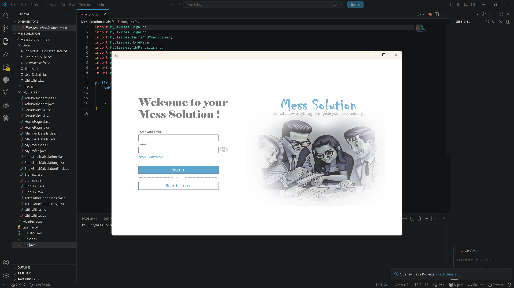

### 📝 Sign Up
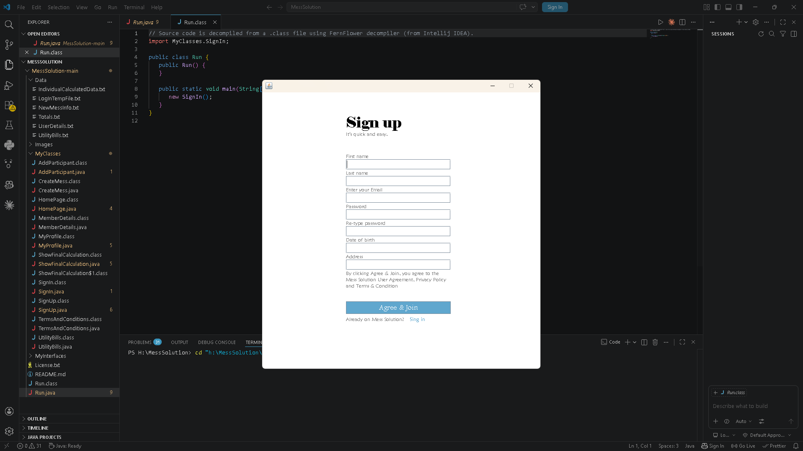

### 📜 Terms & Conditions
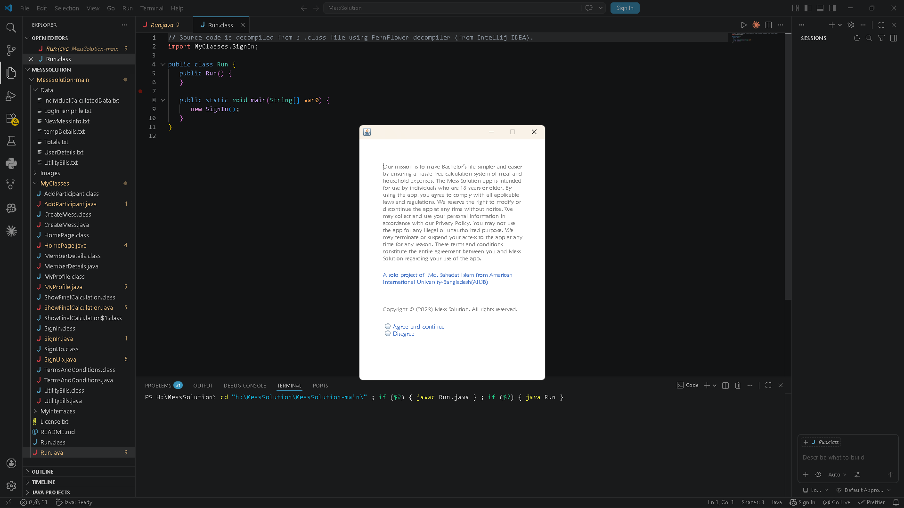

### 👤 Edit Profile
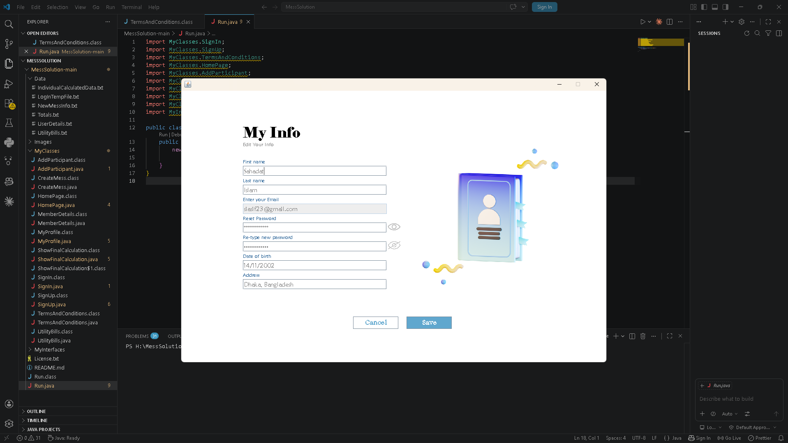

### 💡 Edit Utility Bills
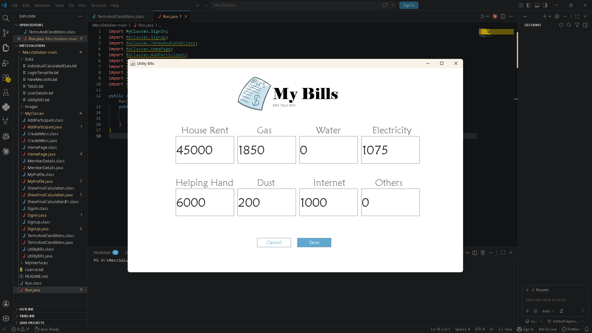

### 🏠 Homepage / Dashboard
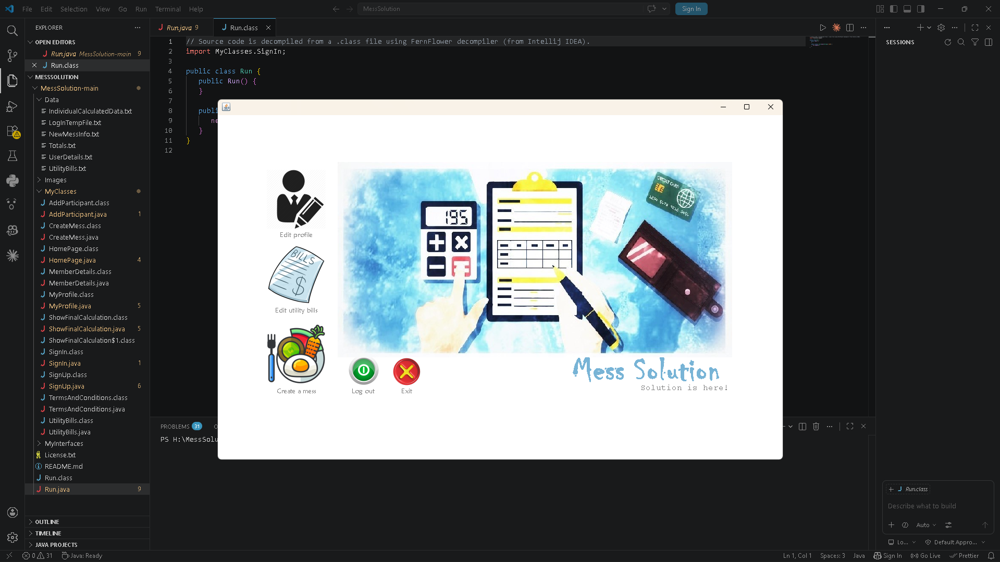

### ➕ Create a Mess
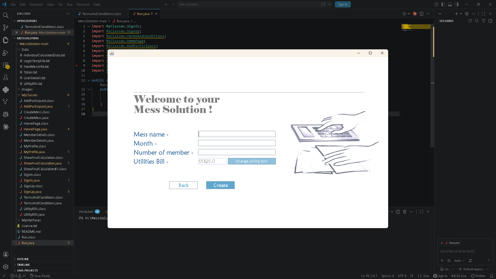

### 👥 Add Participants
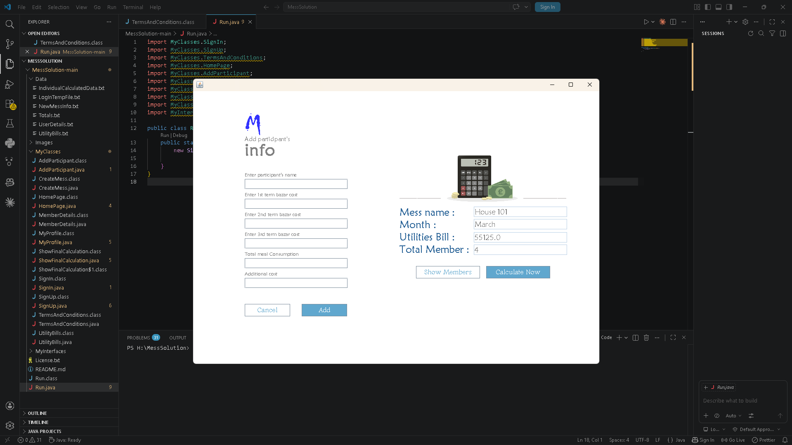

### 📋 Show Participants
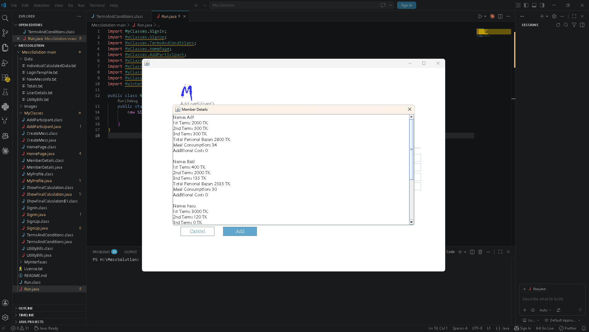

### 🧮 Final Calculation
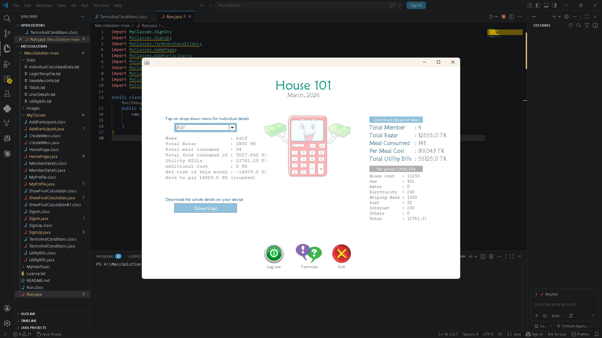

### 📥 Download Details
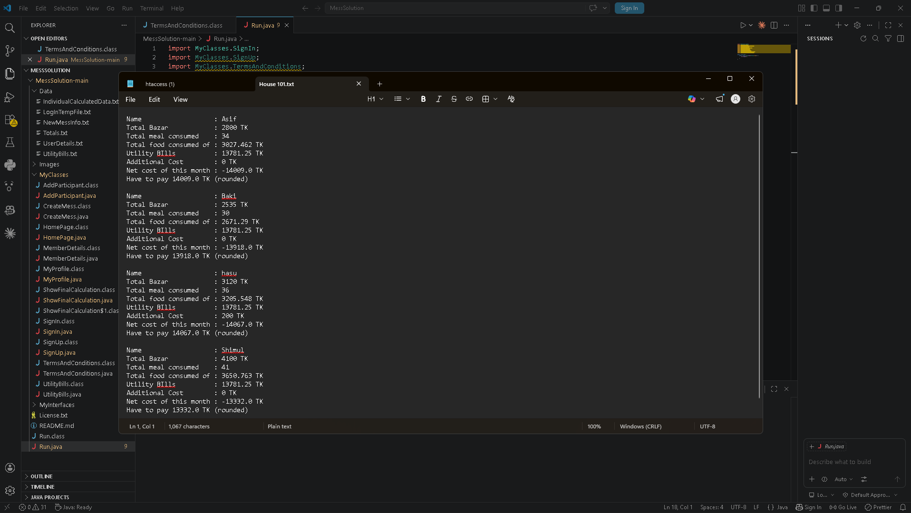

### 📄 Downloaded File Preview
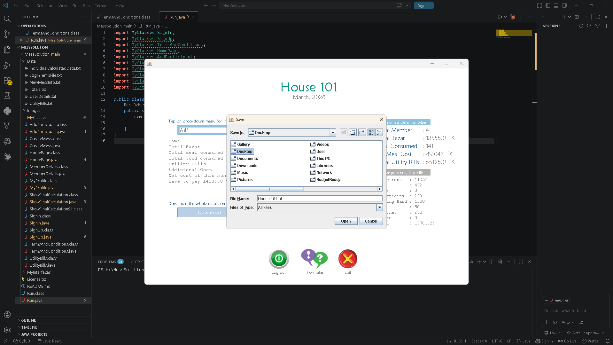

### 📐 Formulas
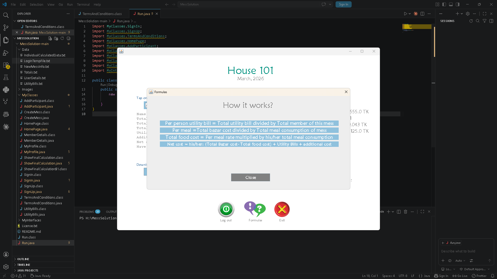
